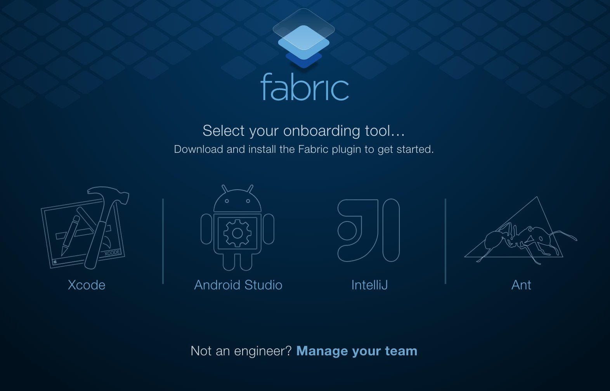
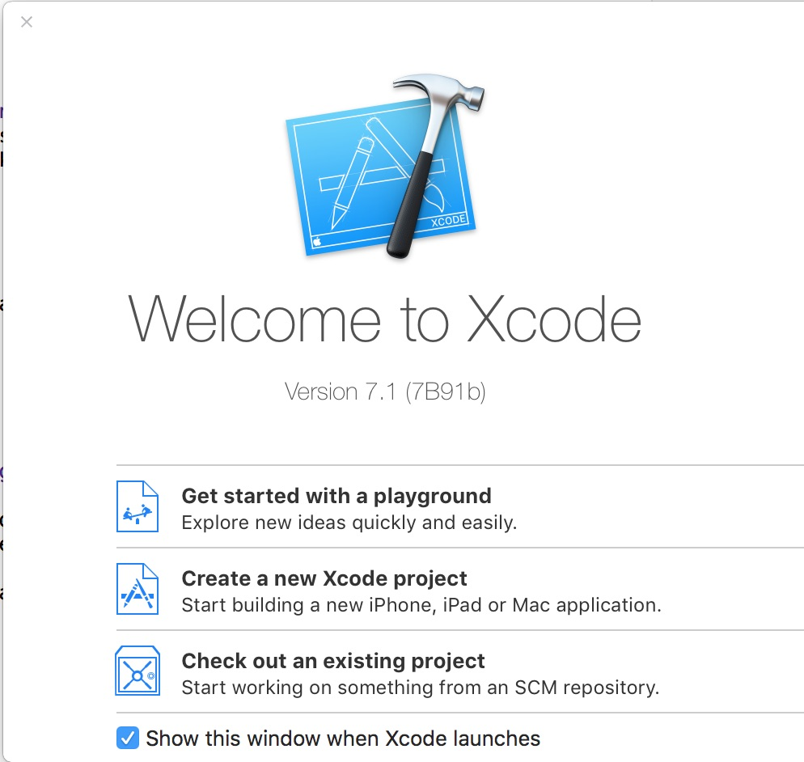
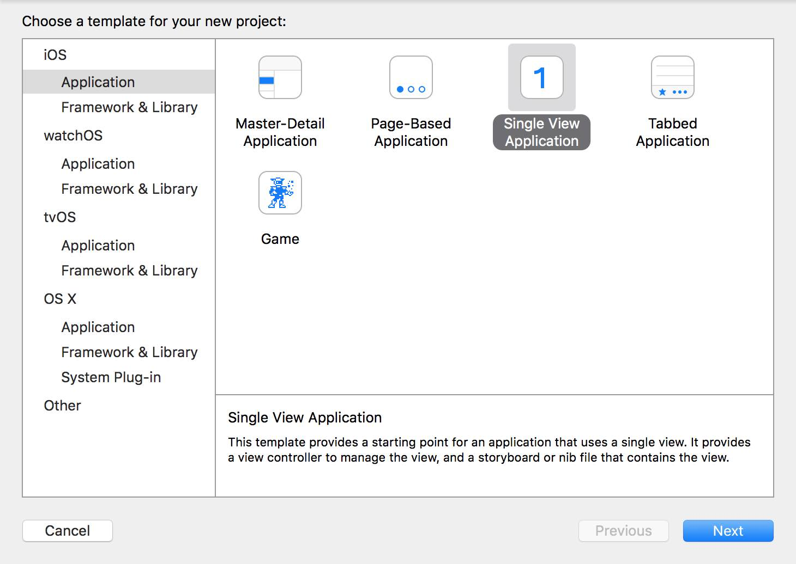
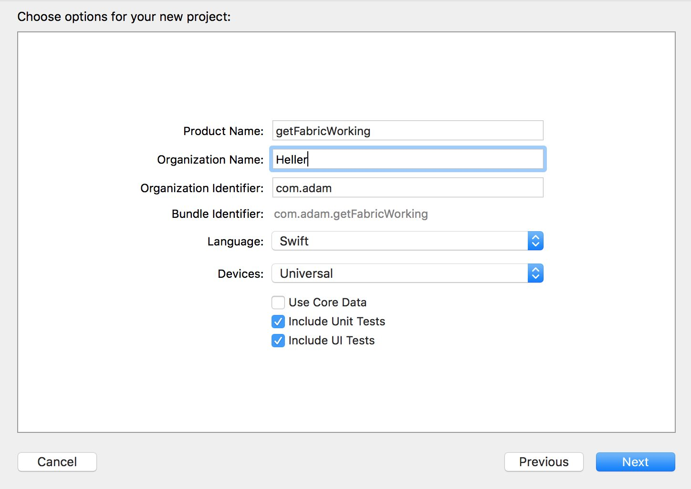

# GSW-twit-fab-web
Getting Started With (GSW) Twitter's Fabric's Digit API for the web.  

I'm writing this to solve a problem that I had after seeing the awesome power behind Fabric's Digit's OAuth-via-text simple mechanism. I had a sprint goal to include this as a login option to my companies website.  

The problem: despite the demo app on [canonballapp.io](http://cannonballapp.io/ "cannonballapp.io"), there aren't clear instructions on how to get a set of API keys for Digit for use purely on the web.  I poked around and tried it with a set of keys from Twitter (with no luck, don't try it). So, here goes.

# Requirements:
* OSX (version shouldn't matter)
* XCode (version shouldn't matter as long as you can build locally)
* Modern web browser
* Internet Connection

# Instructions:

1. Go to [https://get.fabric.io/](https://get.fabric.io/ "https://get.fabric.io/") and register for an account (it's free!).
2. You'll be asked to verify your email address.
3. When you click the confirmation link, select Xcode as your 'onboarding tool' at this screen: 
4. It'll download a little file. In the mean time. Fire up Xcode!  We're gonna build an app! (Didn't know you knew Swift, huh?)
5. Select 'Create a new Xcode project' (the middle option) shown here: 
6. At the next screen, choose 'Single Page Application' under iOS, just as my screen is setup: 
7. On the next screen, you can really name it what ever you want, just leave everything else as I show it (choose swift!). We're really just doing this for the keys: 
8. Click Next and save it where ever you'd like. (Maybe someplace so you can easily delete it later, if you don't want to learn Swift in the process)
9. Ok, cool. Now, open up that file that we downloaded earlier from Fabric. It'll launch an iOS looking app on your desktop. Follow along with those instructions. (You may have to browse and manually select the project file we created a few steps ago, if the app doesnt find it automatically).
10. If that all goes well, you'll be redirected to a success screen!
11. From here, you'll be able to get to the dashboard and get your public and private keys for your Digits app and more or less follow the example code in the Canonball git repo.